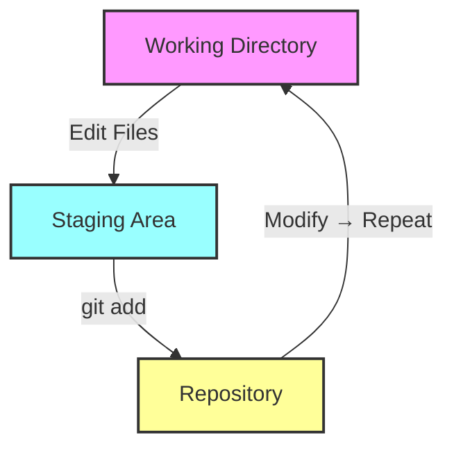
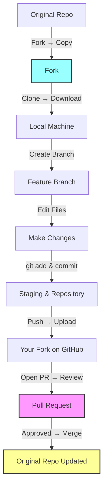
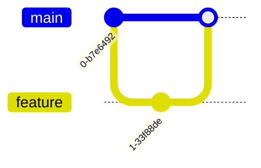
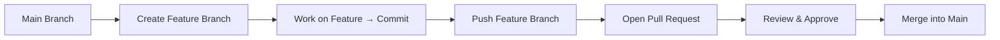

# 📘 Git & GitHub Complete Guide (Beginner → Advanced)

> 🚀 Industry-level notes designed for beginners and future developers

---

# 📑 Table of Contents

1. What is Git & Why Companies Use It
2. What is GitHub
3. Installation & Setup
4. Git Basics (Local)
5. Working with Remote (GitHub)
6. Fork (Real-World Collaboration – Must Know)
7. Branching (Core Industry Skill)
8. Merging & Conflicts (Real Problems)
9. Undoing Mistakes (Very Important)
10. Stashing & Temporary Work
11. Logs & History
12. Advanced Concepts
13. Best Practices (Industry Tips)
14. Common Errors + Fixes
15. Cheat Sheet (Final Revision)

---

# 🧠 0. Before We Start

## 💡 What problem does Git solve?

### Imagine:

You write a document.

You keep saving different versions like:

```
final.doc  
final_v2.doc  
final_final_last.doc 😭  
```

After some time:

* You don’t know which file is the latest
* You can’t see what exactly changed
* If something breaks, you can’t go back easily
* If multiple people edit, everything gets confusing

👉 This becomes messy, confusing, and risky.

---

## ✅ Git solves this by:

* 📌 **Tracking every change** → You know what changed, when, and by whom
* ⏪ **Going back anytime** → Restore any previous version instantly
* 👥 **Supporting teamwork** → Multiple people can work without conflicts
* 🧾 **Maintaining history** → Every version is safely stored

---

### 🧠 In one line:

👉 Git = *Smart history + safe backup + teamwork system*

---

## 🚀 1. What is Git?

Git is a distributed version control system used to track changes in code over time.

### 🔹 Why companies use Git:

* Multiple developers work on the same project
* Track history of changes
* Easily fix bugs by reverting code
* Maintain production stability

### 🔹 Real-world example:# 📘 Git & GitHub Complete Guide (Beginner → Advanced)

> 🚀 Industry-level notes designed for beginners and future developers

---

# 📑 Table of Contents

1. What is Git & Why Companies Use It
2. What is GitHub
3. Installation & Setup
4. Git Basics (Local)
5. Working with Remote (GitHub)
6. Fork (Real-World Collaboration – Must Know)
7. Branching (Core Industry Skill)
8. Merging & Conflicts (Real Problems)
9. Undoing Mistakes (Very Important)
10. Stashing & Temporary Work
11. Logs & History
12. Advanced Concepts
13. Best Practices (Industry Tips)
14. Common Errors + Fixes
15. Cheat Sheet (Final Revision)

---

# 🧠 0. Before We Start

## 💡 What problem does Git solve?

### Imagine:

You write a document.

You keep saving different versions like:

```
final.doc  
final_v2.doc  
final_final_last.doc 😭  
```

After some time:

* You don’t know which file is the latest
* You can’t see what exactly changed
* If something breaks, you can’t go back easily
* If multiple people edit, everything gets confusing

👉 This becomes messy, confusing, and risky.

---

## ✅ Git solves this by:

* 📌 **Tracking every change** → You know what changed, when, and by whom
* ⏪ **Going back anytime** → Restore any previous version instantly
* 👥 **Supporting teamwork** → Multiple people can work without conflicts
* 🧾 **Maintaining history** → Every version is safely stored

---

### 🧠 In one line:

👉 Git = *Smart history + safe backup + teamwork system*

---

## 🚀 1. What is Git?

Git is a distributed version control system used to track changes in code over time.

### 🔹 Why companies use Git:

* Multiple developers work on the same project
* Track history of changes
* Easily fix bugs by reverting code
* Maintain production stability

### 🔹 Real-world example:

In a company, if a new update breaks the login system, developers can revert to a previous working version using Git.

---

## 🌐 2. What is GitHub?

GitHub is a cloud platform that stores Git repositories.

### 🔹 Why GitHub:

* Collaboration with teams
* Backup of code
* Code reviews using Pull Requests

---

## ⚙️ 3. Installation & Setup

```bash
git config --global user.name "Your Name"
git config --global user.email "your@email.com"
```

Check configuration:

```bash
git config --list
```

👉 Verifies your Git setup

---

# 📁 4. Git Basics & Local Workflow

Git has **3 main stages**:
---

---

| Stage             | Purpose                    |
| ----------------- | -------------------------- |
| Working Directory | Create & edit files        |
| Staging Area      | Prepare changes for commit |
| Repository        | Permanently store commits  |

---

### 🔹 Step 1: Create a Project Folder

```bash
mkdir my-project
cd my-project
```

👉 Creates and enters your project folder

---

### 🔹 Step 2: Initialize Repository

```bash
git init
```

👉 Starts tracking your project with Git

---

### 🔹 Step 3: Check File Status

```bash
git status
```

👉 Shows current state of files

---

### 🔹 Step 4: Add Files

```bash
git add file.txt
git add .
```

👉 Adds files to staging area

---

### 🔹 Step 5: Commit Changes

```bash
git commit -m "Initial commit"
```

👉 Saves your first version

---

### 🔹 Step 6: Modify → Add → Commit → Repeat

```bash
# Modify → Add → Commit → Repeat
git add file.txt
git commit -m "Updated feature"

# Example workflow
Edit file1.txt → git add file1.txt → git commit -m "Update file1"
Edit file2.txt → git add file2.txt → git commit -m "Add new content"
```

✅ Repeat Step 6 as you work on files.

---

### 🔹 Real-world example:

You create a project → add files → commit → now Git tracks everything

---

## 🌐 5. Working with Remote (GitHub)

Before connecting Git to GitHub, you must first create a repository on GitHub.

---

### 🔹 Step 1: Create Repository on GitHub

1. Go to GitHub
2. Click **New Repository**
3. Enter repository name (example: `git-github-notes`)
4. Click **Create repository**

👉 This gives you a remote project space in the cloud

---

### 🔹 Step 2: Connect Local Project to GitHub

```bash
git remote add origin <repo_url>
```

### Push code

```bash
git branch -M main
git push -u origin main
```

👉 Uploads code to GitHub

---

### 🔹 Step 3: Pull latest changes

```bash
git pull origin main
```

👉 Always pull before starting work

---

### 🔹 Step 4: Make changes → Add → Commit → Push

After pulling the latest changes, you can work on files locally, stage them, commit, and push back to GitHub:

```bash
# Make edits to files, then add changes
git add file.txt

# Commit with a meaningful message
git commit -m "Updated feature"

# Push changes to the remote repository
git push -u origin main
```

✅ Repeat this workflow as you continue working:

```bash
Edit file1.txt → git add file1.txt → git commit -m "Update file1" → git push
Edit file2.txt → git add file2.txt → git commit -m "Add new content" → git push
```

---

# 🍴 6. Fork (Real-World Collaboration – Must Know)

Perfect — you’re basically describing the **full contribution flow** clearly now. I’d just suggest **slightly restructuring and polishing** it so it reads smoothly and highlights the “why we fork” part explicitly. Here’s a clean version ready to paste:

---

### 🔴 Why Fork Exists (Contribution Scenario)

In real world:

* You find a GitHub project you want to contribute to.
* ❌ You **don’t have permission** to directly push changes to the original repository.

---

### ✅ Solution: Fork

* Fork creates a **full copy of that project in your own GitHub account**.
* Now you can **edit freely** without affecting the original project.

---

### 🧠 What happens after Forking?

```text
Original Repo (Company) → Fork → Your GitHub Account
```

* You **own this copy**
* You can **make changes safely**
* No risk to the original project

---

### 📌 Simple Definition

**Fork = Personal copy of someone else’s repository to work independently and contribute safely**

---

### 🔁 Fork → Contribution Workflow (STEP-BY-STEP)

1. **Fork the repository on GitHub**

   * Click **Fork button** → repo appears in your account

2. **Clone your fork locally**

```bash
git clone <your-fork-url>
```

* Downloads your copy to your system

3. **Create a feature branch**

```bash
git checkout -b feature-improvement
```

* Never work directly on `main`

4. **Make changes → Stage & Commit**

```bash
git add .
git commit -m "Describe your changes"
```

5. **Push branch to your fork**

```bash
git push origin feature-improvement
```

6. **Create a Pull Request (PR)**

* Go to GitHub → Click **Compare & Pull Request**

7. **Owner reviews your code**

* ✅ Accept → Your code merged
* ❌ Reject → You update and resend

---

### 🏢 Real Company / Open-Source Scenario

* You want to **contribute to a company or open-source project**
* You **cannot push directly** → so you:

  * Fork → Work independently → Send PR
* This is how **collaboration works globally**


---

## 🔄 Visual Flow (VERY IMPORTANT)


---

## 🌿 7. Branching (Core Industry Skill)

After forking and cloning a repo, always create a feature branch to work on your changes safely. This branch will later be merged into the main branch via a pull request.

```bash
git checkout -b feature-login
git checkout feature-login
```

👉 Creates and switches branch

### 🔹 Why branching:

* Work on features independently
* Prevent breaking main code
Here’s a **super concise addition for branch naming conventions** to include in your notes:

---

## 🌿 Branch Naming Convention (Short)

| Branch Type     | Format              | Example            |
| --------------- | ------------------- | ------------------ |
| Feature         | `feature/<name>`    | `feature/login`    |
| Bugfix / Hotfix | `bugfix/<name>`     | `bugfix/fix-login` |
| Release         | `release/<version>` | `release/1.0.0`    |
| Main / Stable   | `main` / `develop`  | `main` / `develop` |

✅ **Tip:** Always branch from `develop` (or `main`) and never commit directly to `main`.

---
### 🔹 Real-world example:

* main → production code
* feature-login → your task

---

## 🌿 Branching Diagram


---
**deleting old branches** after merge to keep repo clean:

```bash
git branch -d feature-branch
```

---

## 🔀 8. Merging & Conflicts (Real-World Scenario)


> 💡 **Tip:** After your branch is ready, merge into `main` via Pull Request. Conflicts can happen if multiple people edit the same file.

1. **Merge branch locally (if needed):**

```bash
git checkout main
git merge feature-improvement
```

2. **Push main branch to GitHub:**

```bash
git push origin main
```

3. **Merge conflicts** happen when:

* Two developers modify the same line/file
* Git cannot auto-resolve

4. **Fix conflicts manually:**

* Open the conflicted file → edit to keep correct changes
* Stage the file and commit:

```bash
git add <conflicted-file>
git commit -m "Resolved merge conflicts"
```

5. **Continue workflow:**

* Push resolved changes → PR updated
* Wait for approval → merged into original repo

---

> ⚡ **Pro tip:** Always pull latest changes before starting work to reduce conflicts:

```bash
git pull origin main
```


---



---


### 🏢  Collaboration Workflow (REAL COMPANY FLOW)

```text
git pull origin main
git checkout -b feature-name
git add .
git commit -m "message"
git push origin feature-name
Create Pull Request → Review → Merge
```
---


## 🔙 9. Undoing Mistakes (Very Important)

Sometimes you make a mistake or accidentally stage/commit changes. Git lets you **undo safely**.

---

### 🔹 Undo Staged File

```bash
git reset file.txt
```

* Unstages `file.txt` but keeps changes in working directory

---

### 🔹 Undo Commit (Keep Code)

```bash
git reset --soft HEAD~1
```

* Moves last commit back to **staging area**
* Your code changes are preserved
* Use if you want to **edit commit message** or add more changes

---

### 🔹 Undo Commit + Unstage (Keep Code)

```bash
git reset HEAD~1
```

* Moves last commit **back to working directory**, unstage changes

---

### 🔹 Undo Everything (Discard Code)

```bash
git reset --hard HEAD~1
```

* Completely removes last commit and code changes
* ⚠️ **Warning:** Use carefully – changes cannot be recovered

---

### 🔹 Real-World Tip:

* Use **soft** if you just want to tweak a commit
* Use **hard** only when you’re sure changes aren’t needed

---

## 📦 10. Stashing & Temporary Work

Sometimes you need to **pause your work** and switch tasks. Git **stash** helps save progress temporarily.

---

### 🔹 Basic Stash

```bash
git stash
```

* Saves your **uncommitted changes** and cleans working directory

---

### 🔹 Apply Last Stash

```bash
git stash pop
```

* Restores changes and removes them from stash list

---

### 🔹 View All Stashes

```bash
git stash list
```

* Shows all saved stashes

---

### 🔹 Apply Specific Stash

```bash
git stash apply stash@{2}
```

* Restores changes from stash #2 without deleting it

---

### 🔹 Remove Specific Stash

```bash
git stash drop stash@{2}
```

* Deletes stash #2 from list

---

### 🔹 Real-World Example:

1. Working on feature → urgent bug comes
2. Stash your work → `git stash`
3. Fix bug → commit
4. Return to feature → `git stash pop`

✅ Keeps your work safe and organized

---


## 📜 11. Logs & History

```bash
git log
git log --oneline
```

👉 Shows commit history


---

## 🚀 12. Advanced Concepts

### Rebase

```bash
git rebase main
```

👉 Keeps history clean

### Cherry-pick

```bash
git cherry-pick <commit_id>
```

👉 Apply specific commit

---

## 📁 13. .gitignore

```text
node_modules/
.env
dist/
```

👉 Prevents unnecessary files from being tracked

---

## 🧠 14. Best Practices (Industry Tips)

* Never push directly to main
* Always write meaningful commit messages
* Pull before push
* Use branches for features
* Keep commits small

---

## ⚡ 15. Common Errors + Fixes

### Error: push rejected

```bash
git pull origin main --rebase
```

👉 Fix by syncing latest changes

---

## 📊 16. Cheat Sheet (Final Revision)

| Command      | Purpose         |
| ------------ | --------------- |
| git init     | Initialize repo |
| git add .    | Stage files     |
| git commit   | Save changes    |
| git push     | Upload code     |
| git pull     | Get latest code |
| git branch   | Create branch   |
| git checkout | Switch branch   |
| git merge    | Merge branches  |

---

# 📝 Assignment: Practice Git & GitHub

**Objective:** Apply what you learned in this guide to create, manage, and collaborate on a Git project.

---

### 1. Local Repository Practice

1. Create a folder called `git-practice`.
2. Initialize it as a Git repository (`git init`).
3. Create 3 files: `index.html`, `style.css`, `app.js`.
4. Stage and commit each file with proper messages.
5. Make a change in `app.js` and commit again.
6. Undo the last commit using `git reset --soft HEAD~1`.

---

### 2. GitHub Remote Practice

1. Create a new repository on GitHub named `git-practice`.
2. Connect your local repo to GitHub (`git remote add origin ...`).
3. Push your commits to the remote repo.
4. Modify `style.css` and push the changes.

---

### 3. Branching & Collaboration

1. Create a branch called `feature/navbar`.
2. Add a simple navbar in `index.html` and commit.
3. Merge it back to `main` using a Pull Request on GitHub.
4. Delete the branch after merging.

---

### 4. Fork & Pull Request (Optional for Open-Source Practice)

1. Fork a small public GitHub project (like a mini HTML/CSS template).
2. Clone your fork locally.
3. Create a branch, make a small change (like changing a heading).
4. Push the branch and create a Pull Request to the original repo.

---

### 5. Stash Practice

1. Make uncommitted changes in `app.js`.
2. Stash the changes (`git stash`).
3. Make a quick edit in `index.html` and commit.
4. Apply the stashed changes (`git stash pop`).

---

### ✅ Submission:
1. Create a README.md in your repo.  
2. Write a short summary of what you did (commits, branches, PRs).  
3. Add screenshots if you want.  
4. Share the GitHub repo link in the group or by email.

---

## 🏁 Final Note

This guide helps:

* Beginners understand Git from zero
* Students prepare for real-world development
* Developers follow proper workflow

---

## 👩‍💻 Author

**Ryakala Bhuvaneshwari**

